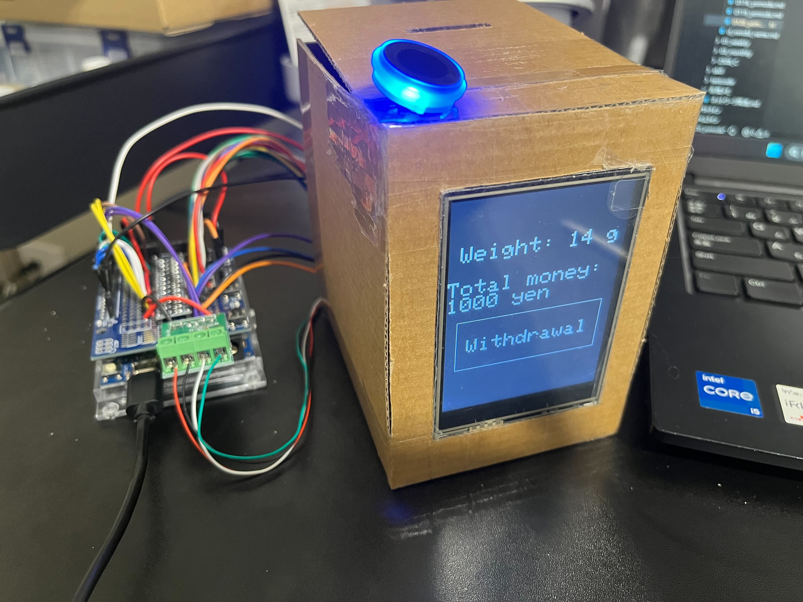
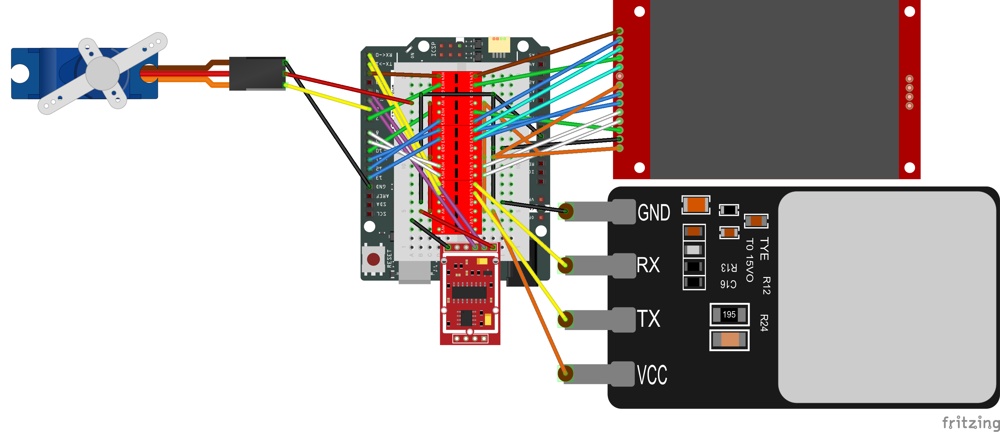
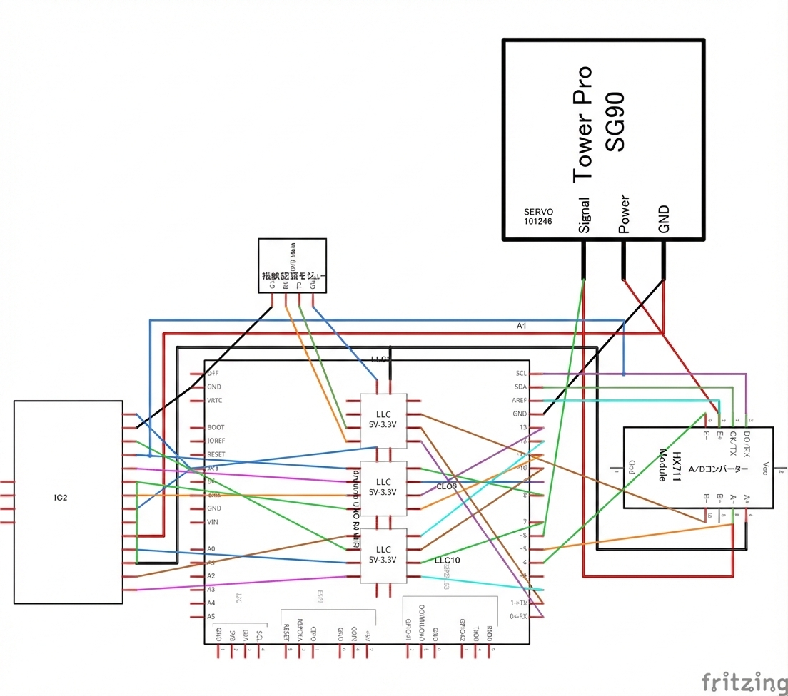
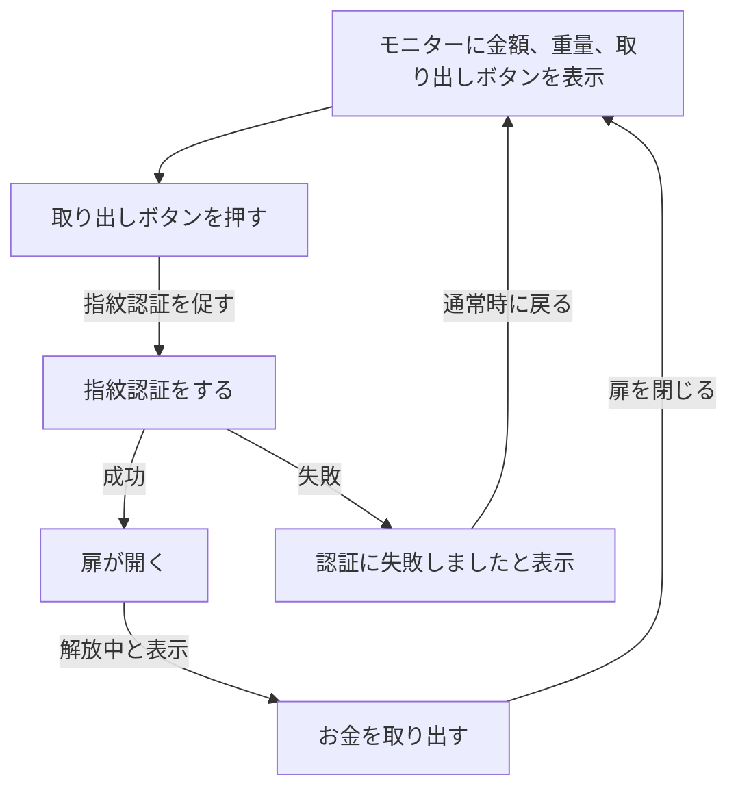

# 2025年卒業制作3期

## 概要

Arduino UNO R4 Wifiを用いた、重さの検知と指紋認証でロック解除できる500円玉貯金箱

## 主な機能

ロードセルを使用した、貨幣の重さを検知  
LCDタッチパネルへの重量と金額の表示  
指紋認証モジュールとサーボモーターでの施錠管理

## 仕様書

### 使用モジュール

|部品|個数|用途|接続ピン|
|-|-|-|-|
|Arduino UNO R4 Wifi|1個|制御|USBケーブル|
|Arduino UNO用シールド基盤|1個|制御  ブレッドボードの代用  規模縮小のため|Arduino UNO R4 Wifi|
|ロードセル|1個|重さセンサー|ch2 1.AVDD：1 2.GND：2 ch3 1.INNA：1 2.INPA：2 |
|ロードセル用ADコンバーター|1個|ロードセルの抵抗値を測定し変換する|VCC：5V GND：GND DAT：4 CLK：5|
|ジャンパーワイヤー|沢山|配線|各ピン|
|LCDタッチパネル※1|1個|表示|VCC/LED：3.3V GND：GND CS：10 RESET：8 DC：9 SDI(mosi)/T_DIN(mosi)：11 SCK/T_CLK：13 T_CS：7 T_DO(miso)：12 T_IRQ：2|
|レベルコンバータ|3個|arduinoとLCD、指紋認証モジュールを接続するため|各モジュールピン|
|指紋認証モジュール※1|1個|指紋認証|VCC：3.3V GND：GND TX：0 RX：1|
|サーボ|1個|扉の開閉制御|VCC：5V GND：GND SERVO：6|

※1：Arduino UNO R4 Wifiは5V、LCDタッチパネルと指紋認証モジュールは3.3Vで動作するため、レベルコンバーターを介し電圧を下げてからピンに接続する必要がある

### ブレッドボード図

### 回路図

### 簡単なフローチャート

### 画面遷移

通常時

指紋認証待機

認証成功

認証失敗

### ソフトウェア

#### 標準ライブラリ

Arduino.h  
Servo.h

#### 追加ライブラリ

指紋認証モジュール  
Adafruit_Fingerprint.h  

画面表示  
SPI.h  
Adafruit_GFX.h  
Adafruit_ILI9341.h  

タッチパネル  
SPI.h  
XPT2046_Touchscreen.h

### 参考サイト

- ロードセル
  - [webサイト](https://deviceplus.jp/arduino/arduino-dezitaru-keisoku-2/)
  - [解説動画](https://youtu.be/1BfKZ6SDnD0?si=p0DVoaR5B4i8J-f0)
  - [キャリブレーションの解説](https://youtu.be/sxzoAGf1kOo?si=oG0q9NBSkf5GrbU3)

- 貨幣の重さ
  - [財務省](https://www.mof.go.jp/policy/currency/coin/general_coin/list.htm)

- LCDタッチパネル
  - [動画](https://www.youtube.com/watch?v=UAqyy7OqpZY)
  - [webサイト](http://jh7ubc.web.fc2.com/Arduino_R4/Arduino_UNO_R4_TFT.html)

- 指紋認証モジュール
  - [解説動画](https://www.youtube.com/shorts/sTgih5Lm5V8)
  - [webサイト](https://www.adafruit.com/product/4750)

- サーボ
  - [Arduino基本プロジェクト](https://docs.sunfounder.com/projects/elite-explorer-kit/ja/latest/basic_projects/27_basic_servo.html)
